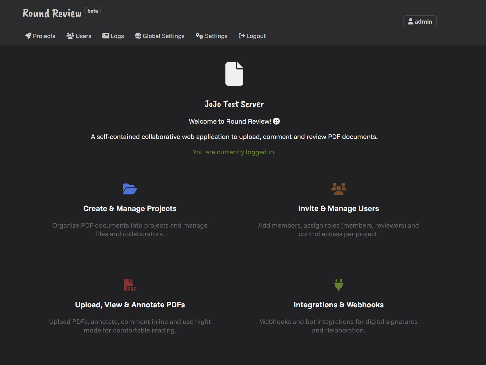
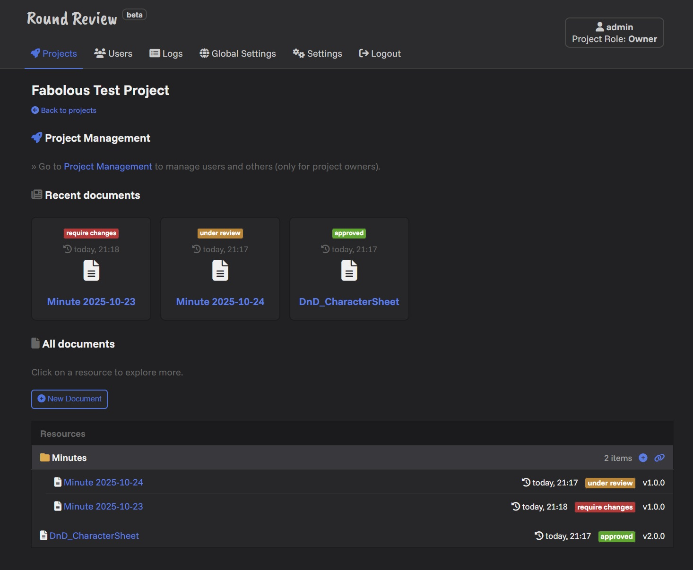
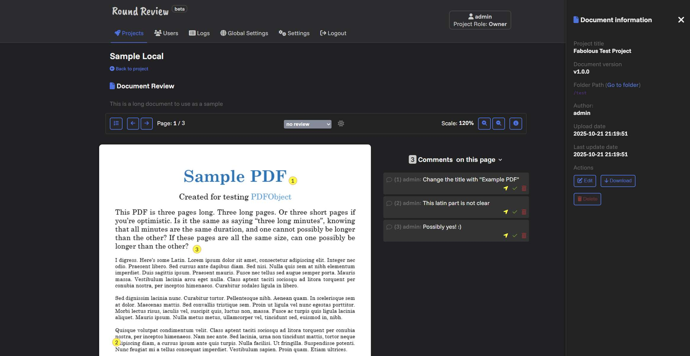

# 
📄 Round Review

Round Review is a PDF platform to manage documents and reviews with collaborators.

> [!NOTE]
> The project is under active development and the current version is in **beta**

Checkout more [screenshots](https://github.com/Maxelweb/RoundReview/releases/tag/v0.2.0).

## Features

- 📁 **Create and manage projects** with PDF documents  
- 👥 **Invite and manage users** in each project  
- 📄 **Upload, view, and edit PDFs**  
  - Includes **night mode** for comfortable viewing

- 💬 **Click & comment on PDFs** for reviewers and project owners  

- 🎨 **Multi-theme support** (light/dark) 
- 🔐 **Basic and advanced user access**  
  - Includes **GitHub OAuth integration**  
- 🔔 **Webhook support** for notifications  
- 🔌 **API-based access** to all features  
  - 📚 Documentation is currently under development  
- 🐳 **Docker-based deployment** configurable via `.env`  
- 🛡️ **System admin panel** with audit logs  
- 🤖 **Bot Integration Review**  
  - Supports external bots via 3rd-party API for document reviews  
    - 📝 *Example 1:* When a document is `Approved`, apply a signature to the PDF  
    - 🧠 *Example 2:* Create your own AI integration for LLM-based summaries and reviews  

## Installation and Maintenance

> [!IMPORTANT]
> Follow these instructions to get the container up and running properly

### Requirements

- Docker with Docker Compose (v2+)

### First installation - Round Review App

1. Clone the repository in your system
    - `git clone https://github.com/Maxelweb/RoundReview.git`
1. Prepare the environment variables file
    - `cp envs/template.rr-app.env envs/rr-app.env`
1. Edit the environment file `envs/rr-app.env` according to your needs (see [envs documentation](./docs/envs.md))
1. Start the Round Review (app) container
    - `docker-compose up roundreview_app -d --build`
1. Go to [localhost:8080](http://localhost:8080)
    - In case of port error (e.g. already in use), change the first port inside the docker-compose file to something else
    - To stop this, use `docker-compose down roundreview_app`

#### Default admin credentials and password

The following credentials applies only if you didn't change the default environment variables configuration.

- Email: `admin@system.com` 
- Password: `<randomly generated>` (check docker logs)

> [!WARNING]
> If you didn't change the default **admin password** to something else, you MUST check the logs from the docker container to get the generated password (`docker logs roundreview_app`). If you missed it, restart from scratch by removing the volumes created.

### First installation - PDF Notary Bot Plugin

> [!TIP]
> If you want to enable and start the **PDF Notary Bot** plugin follow also these instructions

1. Create a folder within the docker compose file and move inside it: 
    - `mkdir ./certs && cd ./certs`
1. Generate a new SSL certificate: 
    - `openssl req -x509 -nodes -days 365 -newkey rsa:4096 -keyout key.pem -out cert.pem`
1. Prepare the environment variables file
    - `cd .. && cp envs/template.rr-pdf-notary-bot.env envs/rr-pdf-notary-bot.env`
1. Edit the environment file according to your needs (see [envs documentation](./docs/envs.md))
1. Start the container: 
    - `docker-compose up roundreview_pdf_notary_bot -d --build`
      -  In case of port error (e.g. already in use), change the first port inside the docker-compose file to something else
      - To stop the container, use `docker-compose down roundreview_pdf_notary_bot`

### Docker stack management

1. `docker-compose up -d`: Start all containers in the stack
1. `docker-compose down`: Stop all containers in the stack

> [!TIP]
> Copy `docker-compose.yml` and paste as `docker-compose.custom.yml`. Then customize the stack according to your needs.

1. `docker-compose -f docker-compose.custom.yml up -d`
1. `docker-compose -f docker-compose.custom.yml down`

### Version update (with GIT)

1. `git pull` the last updates from the repo
1. `docker-compose up -d --build`: Start and build all containers; this will automatically update the internal database

## Documentation

Go to [docs/](./docs/README.md) folder for more documentation.

## License and Credits

[Apache 2.0 License](./LICENSE)

Developed by [Maxelweb](https://github.com/Maxelweb) for anyone!